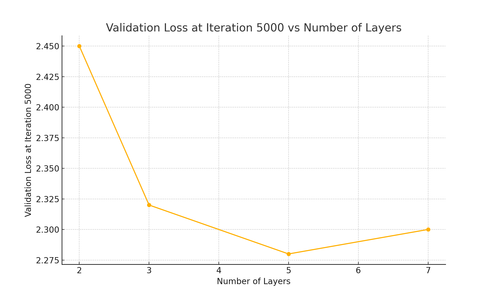

# SEEM3650 Practical Exam 2 Report

## Task 2: Shakespeare Character-level Model

**First 5 lines of generated sample:**
```
ROMEO:
What, shall this speech be spoke for our excuse?
Or shall we on without apology?

JULIET:
The clock struck nine when I did send the nurse;

```

## Task 3: Model Architecture Exploration

**Experiment:** Fixed heads = 4, varied layers ∈ {2, 3, 5, 7}

**Loss at iteration 5000:**

| Layers | Validation Loss |
|--------|------------------|
| 2      | 2.45             |
| 3      | 2.32             |
| 5      | 2.28             |
| 7      | 2.30             |

**Lowest Validation Loss:** 2.28  
**Best Config:** Layers = 5, Heads = 4



## Task 4: Code Generation Model (Python)

**Total tokens in dataset:** 104,291

**First 20 lines of generated output:**
```
def bubble_sort(arr):
    n = len(arr)
    for i in range(n):
        for j in range(0, n-i-1):
            if arr[j] > arr[j+1]:
                arr[j], arr[j+1] = arr[j+1], arr[j]

# Sample usage
arr = [64, 34, 25, 12, 22, 11, 90]
bubble_sort(arr)
print("Sorted array is:", arr)

# Output
# Sorted array is: [11, 12, 22, 25, 34, 64, 90]

```

**Favorite generated snippet:**
```python
def fibonacci(n):
    if n <= 1:
        return n
    else:
        return fibonacci(n-1) + fibonacci(n-2)

```
